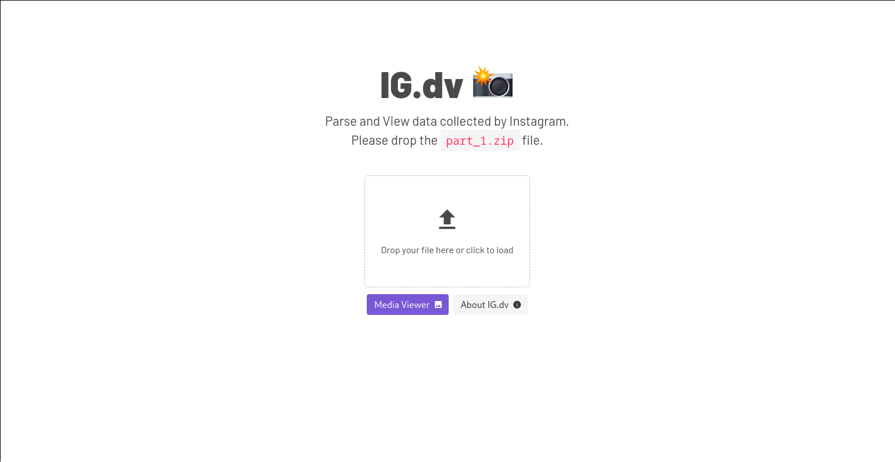

# Instagram - Data Viewer

## Assets

The following SVG assets were from [unDraw](https://undraw.co/).
I may not need to credit them but their resources are really good.

## TODO

- Media collection reader.
- Use Vue Mixins to reduce code redundancy.
- Implement Unit Tests.
- Smart tools (Future features).
  - Find out what you were doing at a certain time (activity tracking).
  - Check where you were when doing these activities.
  - Location & Activity filtering.

## Setup
The setup is pretty similar to those of Vue-cli projects.
You can read more about it [here](https://cli.vuejs.org/).

`$ yarn install` Install package dependencies

`$ yarn serve` To run in development mode w/Hot reload.

`$ yarn build <options>` See [electron-build](https://www.electron.build/) for options.